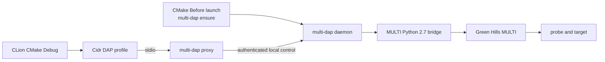

# Configure CLion

CLion is the primary supported IDE for `multi-dap`. The supported integration
uses CLion's native **Cidr DAP CMake Debug** path and an authenticated local
stdio proxy. It does not use Python **Attach to DAP**, a fixed TCP debug port,
or a generated `.idea` file.

| Item | Supported contract |
|---|---|
| IDE baseline | Validated with CLion 2026.2.1 (build 262.9437.136). |
| Later observation | A limited CLion 2026.3 hardware run covered attach, stacks, evaluation, Memory View, and Disassembly. |
| Host | Windows amd64 with a separately licensed Green Hills MULTI installation. |
| CLion entry point | A CMake Application using the `multi-dap` DAP Debug Profile. |
| Adapter transport | `multi-dap.exe proxy --config "<absolute-project.toml>"` over `stdin/stdout`. |
| Session preparation | Explicit `ensure --acquisition cold` or explicit `ensure --acquisition warm`. |
| Evidence level | Hardware-observed within the limits listed below; not every DAP operation is qualified. |

The UI names or storage format may change in later CLion releases. Revalidate
the fields in this guide after an IDE upgrade; do not copy or hand-edit `.idea`
files from another machine.

See JetBrains' documentation for the surrounding
[DAP Profile](https://www.jetbrains.com/help/clion/dap-support.html),
[External Tool](https://www.jetbrains.com/help/clion/configuring-third-party-tools.html),
and [CMake Application](https://www.jetbrains.com/help/clion/run-debug-configuration-application.html)
UI. The `multi-dap` values and safety rules below remain repository-specific.

## Connection model



`ensure` establishes or reuses one authenticated daemon before CLion starts
the DAP profile. The proxy then authenticates through the owner-only control
record and upgrades that same local socket to DAP. CLion never needs the
control token or a fixed DAP port.

## 1. Prepare the package and project configuration

Keep this package layout intact:

```text
<package-root>/
  multi-dap.exe
  bridge/bridge.py
  examples/multi-dap.example.toml
```

For an extracted archive, set `$PackageRoot` to that directory:

```powershell
$PackageRoot = '<absolute-package-root>'
```

For a future WinGet installation or another PATH-based installation, resolve
the actual binary directory instead:

```powershell
$MultiDap = (Get-Command multi-dap.exe -ErrorAction Stop).Source
$PackageRoot = Split-Path -Parent $MultiDap
```

Copy the example configuration to a private location and edit the copy:

```powershell
$MultiDap = Join-Path $PackageRoot 'multi-dap.exe'
$ConfigPath = 'C:\private\multi-dap-project.toml'
Copy-Item "$PackageRoot\examples\multi-dap.example.toml" $ConfigPath
& $MultiDap check --config $ConfigPath
```

The configuration must describe the target, not the CLion project UI:

| TOML field | Contract |
|---|---|
| `multi.installation` | Existing local MULTI installation directory. |
| `multi.executable` | `mpythonrun.exe` inside that installation. |
| `connection.project` | Existing MULTI project file loaded for cold acquisition. |
| `connection.arguments` | Exact private target-server arguments supplied by the operator. |
| `connection.preparation` | `none` or the explicit `already_present_no_verify` policy. |
| `cores[].id` | Unique non-negative MULTI core ID. |
| `cores[].elf` | Existing ELF path unique to that core. |
| `inspection.default_core` | Required for unambiguous numeric-address inspection on a multicore target. |
| `source_rewrites` | Optional, non-overlapping absolute debug-path to client-path mappings. |
| `endpoints.*` | Numeric loopback hosts; port `0` is recommended for automatic allocation. |
| `timing.*` | Positive Go duration values for polling, RPC, and startup. |
| `lifecycle.require_reset_after_download` | Safe target-lifecycle gate; omitted values default to `true`. |
| `probe.id` | Globally unique local identity for this exact project and physical-probe binding. It keys the daemon record and physical-probe lock. |

Start from the repository's root `multi-dap.example.toml` or the package's
`examples/multi-dap.example.toml` rather than removing sections. `check`
validates files, paths, endpoints, durations, core identity, and source-rewrite
rules without starting MULTI or connecting the target. The
[project configuration reference](configuration.md) defines every field,
default, normalization rule, and safe edit procedure.

Do not commit the populated TOML. It may contain private paths, connection
arguments, probe identity, and firmware information.

!!! danger "Do not reuse `probe.id` across projects"

    Treat the `[probe].id` value as the local target/session routing identity.
    Give every
    intended project and physical-probe binding a distinct value and do not
    copy the example unchanged. A same-ID daemon created from different
    validated target semantics is rejected, but the record and physical-probe
    lock still share this namespace. The ID is not a credential.

The supported CLion profile passes the same absolute TOML path as `ensure`.
Every config-bound control operation derives an opaque SHA-256 binding from the
normalized, validated runtime values and compares it with the owner-only daemon
record before authentication or DAP forwarding. A same-ID record for different
project, connection, core, endpoint, timing, lifecycle, inspection, or rewrite
semantics fails closed with `control: daemon configuration does not match`.
The digest and its input values are not exposed through DAP, `status`, logs, or
terminal diagnostics.

The binding represents validated semantics, not TOML bytes or the TOML file's
location. Comments and formatting do not change it, and two files that
normalize to the same values have the same binding. The contents of referenced
project, ELF, and source files are not hashed. Shut down the daemon with the
current TOML before changing a runtime value. If a live daemon reports a
configuration mismatch after an edit, restore the previous semantic
configuration and shut it down normally; do not delete its record or bypass
the binding with the legacy identity-only proxy.

## 2. Choose the session acquisition policy

Choose one policy explicitly. Never omit `--acquisition`: the CLI default is
not a project-level safety decision.

### Managed cold session

Use cold acquisition when `multi-dap` should create and own a new target
connection from the TOML configuration:

```text
ensure --config "<absolute-project.toml>" --bridge-script "<absolute-package-root>\bridge\bridge.py" --acquisition cold
```

Cold acquisition can consume a MULTI license and contend for a probe. It does
not first search for an operator-owned session. If
`connection.preparation = "already_present_no_verify"`, it requests MULTI's
documented no-download, no-flash, no-reset, no-memory-verification preparation;
otherwise it performs no preparation command.

### Existing warm session

Use warm acquisition only when an operator has already established the intended
MULTI session:

```text
ensure --config "<absolute-project.toml>" --bridge-script "<absolute-package-root>\bridge\bridge.py" --acquisition warm --primary-elf "<configured-exact-primary-elf>"
```

The primary ELF must exactly match the full path of one configured core. Warm
discovery requires one unique, stable program binding and a discoverable local
service router. Failure is terminal for that attempt; warm acquisition never
falls back to cold or chooses the first debugger window.

## 3. Create the Before Launch External Tool

In **Settings | Tools | External Tools**, add a tool named
`multi-dap ensure`:

| Field | Value |
|---|---|
| Program | `<absolute-package-root>\multi-dap.exe` |
| Arguments | One exact cold or warm `ensure` argument line from the previous section. |
| Working directory | `$PROJECT_DIR$` or the absolute project root. |

The explicit bridge path pins the reviewed package component even though a
packaged executable can normally discover `bridge/bridge.py` beside itself.
Do not put target connection arguments, a service-router address, or a control
token in the External Tool.

On Windows the default control directory is under
`%APPDATA%\multi-dap\control`; it must remain private and outside the project.
The packaged profile contract assumes this default. If it cannot be used, append the same
`--control-dir "<absolute-private-directory>"` to both the `ensure` arguments and
the proxy arguments in the next section. A mismatch makes the proxy unable to
find the daemon.

Test the command once from a terminal. A successful result is one JSON object
whose event is `ready` or `already_ready`:

```powershell
& $MultiDap ensure `
  --config $ConfigPath `
  --bridge-script (Join-Path $PackageRoot 'bridge\bridge.py') `
  --acquisition cold
```

`ensure` is synchronous, short-lived, and idempotent. It is not a resident
debug adapter process.

## 4. Create the Cidr DAP Debug Profile

In **Settings | Build, Execution, Deployment | Debugger | Debug Profiles**,
create a DAP profile:

| Field | Value |
|---|---|
| Name | `multi-dap` |
| Executable | `<absolute-package-root>\multi-dap.exe` |
| Arguments | `proxy --config "<absolute-project.toml>"` |
| Communicate with the debugger via | `stdin/stdout` |

Use the same absolute private TOML path as the Before Launch `ensure` action.
The proxy validates the file, derives its probe ID and semantic configuration
binding, and refuses a record created for different target semantics.

Enter this exact object in the profile's **Launch** tab:

```json
{"request":"attach"}
```

Do not use the profile's **Attach** tab, configure a TCP Remote address, or
provide `host`, `port`, or `debugServer`. The proxy discovers the daemon from
the authenticated local control record. The CLI retains `--probe-id` only as a
legacy, identity-only compatibility path. It does not verify the project
configuration and is not a supported CLion profile argument.

## 5. Bind the Profile to the CMake Application

In **Run | Edit Configurations**:

1. Select each applicable **CMake Application** configuration.
2. Choose `multi-dap` as its **Debug Profile**.
3. Under **Before launch**, select **+ | Run External Tool** and add
   `multi-dap ensure`.
4. Save the configuration, reopen it, and confirm that both the Debug Profile
   and Before Launch tool remain selected.

The External Tool and DAP Debug Profile are separate CLion objects. Creating
one does not attach it to the CMake configuration automatically.

Remove or disable any legacy Python **Attach to DAP** configuration. It is not
part of the supported integration.

## 6. Start the first Debug session

Before the first session, open **Run | View Breakpoints**
(`Ctrl+Shift+F8`) and disable every Exception Breakpoint. An empty exception
configuration is accepted for client compatibility; a non-empty one fails
closed because MULTI exception-stop semantics are not implemented.

Select `<your-cmake-application>` and click **Debug** using the bug icon. Do
not click the green **Run** button: that asks Windows to execute the
target-architecture ELF directly and never starts DAP.

For the first validation, confirm:

1. Before Launch reports `ready` or `already_ready` without opening a second
   MULTI session.
2. **Threads** lists the configured cores.
3. A stopped core supplies a source stack and top-level scopes.
4. **Evaluate Expression** (`Alt+F8`), Variables, or Live Watches can evaluate
   within the documented boundary.
5. A known safe address can be opened through **Memory View | Go To Address**;
   multicore numeric addresses route through `inspection.default_core`.
6. Detach leaves the daemon available and does not reset, download, resume,
   halt, or close the MULTI session.

CLion's Console is an output view for this DAP backend, not an interactive
MULTI command prompt. Use Evaluate Expression for supported expressions.

## Operate and stop the daemon

Use the same configuration and, when applicable, the same control directory:

```powershell
& $MultiDap status --config $ConfigPath
& $MultiDap diagnose --config $ConfigPath
& $MultiDap shutdown --config $ConfigPath
```

When a custom control directory is configured, append the same
`--control-dir "<absolute-private-directory>"` to all three commands above.

Closing a CLion DAP session releases only frontend ownership. `shutdown`
explicitly stops the daemon and its bridge. For a cold runtime, shutdown also
closes the target connection that `multi-dap` created. A warm runtime does not
disconnect the operator-owned target connection. Neither mode kills unrelated
MULTI, service-router, or target-server processes by process name.

## Troubleshooting

| Symptom | Check |
|---|---|
| Proxy reports no daemon record | Run `ensure` first; confirm the profile uses the same `--config` path and `--control-dir` as Before Launch. |
| Daemon configuration does not match | A same-ID record belongs to different validated semantics, or the TOML changed while its daemon was running. Restore the prior configuration and shut that daemon down normally; do not use legacy `--probe-id` as a bypass. |
| `ensure` rejects the configuration | Run `& $MultiDap check --config $ConfigPath` and fix every reported field before opening CLion. |
| Warm acquisition cannot bind | Confirm the intended MULTI session and local service router are running, and use the exact configured primary ELF path. Do not retry as implicit cold. |
| A second MULTI session appears | Use warm acquisition for an operator-owned session; cold acquisition intentionally creates a managed connection. |
| Exception breakpoint setup fails | Disable every Exception Breakpoint in CLion. |
| A source breakpoint is unverified | Confirm exact source paths or add a non-overlapping `source_rewrites` mapping. The adapter does not guess. |
| Memory View is ambiguous | Set `inspection.default_core` to a configured core ID or use a core-qualified frame reference. |
| Another editor cannot attach | Only one active DAP frontend owns the daemon; detach the existing CLion or VS Code client first. |
| CLion tries to execute the ELF | Use the Debug bug icon and confirm the CMake Application has the `multi-dap` Debug Profile. |
| The daemon exited | Run `diagnose`; it returns a sanitized lifecycle classification without exposing raw MULTI output or tokens. |

## Supported CLion capabilities and limits

| CLion surface | Current status |
|---|---|
| Native Cidr DAP attach and detach | Attach is hardware-observed. Detach protocol behavior is verified, but full disconnect-safety qualification remains open. |
| Threads and per-core source stacks | Supported while the target is stopped. |
| Top-level scopes, locals, and evaluation | Supported within the bounded expression policy. |
| Source-breakpoint set and clear | Hardware-observed; an actual breakpoint hit remains unverified. |
| Parallel Stacks View | Uses standard DAP threads and paged stack traces. |
| Console output | Target and I/O panes are forwarded as bounded `stdout` events. Interactive command input is unsupported. |
| Memory View and Disassembly | Read-only, stopped-state paths are hardware-observed; avoid side-effecting MMIO. |
| `next` and `stepIn` | Partial: wired at statement granularity for one configured core; multicore is rejected and hardware execution acceptance remains open. |
| Multicore stepping | Unsupported until an execution-domain implementation can prove group state. |
| `stepOut`, registers, instruction stepping, memory writes | Unsupported and fail closed. |
| VS Code-style `launch` | Unsupported; CLion must send `attach`. |

The authoritative operation-level matrix is the
[capabilities and development status](capabilities.md). The release archive's
`editors/clion/README.md` contains an offline copy of the full client contract
and hardware validation checklist, while
[Windows packaging and editor evidence](m6-packaging-and-editors.md) records
the evidence boundary.
