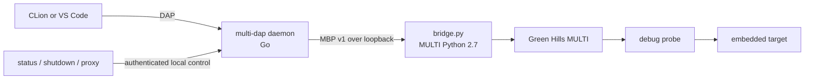

# multi-dap

`multi-dap` exposes a Green Hills MULTI debug session through the Debug Adapter
Protocol (DAP). A Go daemon owns protocol state and orchestration; a narrow
Python 2.7 bridge performs the calls that must run inside MULTI.

!!! warning "Release and evidence boundary"

    This public repository is MIT-licensed and has strong host-side tests plus
    a deterministic Windows package, but no public release has been issued.
    Several hardware behaviors remain explicitly unverified. A passing CI run
    does not upgrade software evidence into target qualification.

!!! success "CLion is the primary supported IDE"

    The native Cidr DAP CMake Debug path has hardware-observed coverage for
    attach, configured-core threads and stacks, top-level inspection,
    read-only Memory View and Disassembly, and source-breakpoint
    synchronization within the published limits. Follow the
    [CLion configuration guide](clion.md) for the complete setup.

## System shape

The daemon serializes target operations through a Session Actor, treats state
transitions as canonical, scopes handles to stop epochs, and rejects ambiguous
or unsupported requests before bridge I/O.

## Choose a path

- [Get started](getting-started.md) to build, configure, and start a local
  daemon.
- [Configure CLion](clion.md) for the supported Cidr DAP Profile, Before
  Launch daemon preparation, cold/warm acquisition, and troubleshooting.
- [Project configuration](configuration.md) for every TOML field, validation
  rule, semantic binding, and safe change procedure.
- [Architecture](architecture.md) for component responsibilities, state
  machines, trust boundaries, and design decisions.
- [Capabilities and development status](capabilities.md) for the authoritative
  support and evidence matrix.
- [Developer guide](development.md) for repository checks and test layers.
- [Windows distribution](distribution.md) for source builds, ZIP verification,
  manual lifecycle, and the intended WinGet interface.
- [Operations guide](operations.md) for deployment, lifecycle, diagnosis, and
  recovery.
- [Release guide](releasing.md) for candidate construction, publication gates,
  and WinGet handoff.
- [Security model](security.md) for local control, sensitive data, and
  supply-chain requirements.
- [GitHub configuration](github-configuration.md) for the external rulesets,
  protected environments, and release settings required before publication.
- [Hardware findings](m0-findings.md) for the exact observations behind the
  MULTI integration contract.

The release archive and runtime are currently supported only on Windows amd64.
The Go packages also compile and run host tests on non-Windows systems, but the
MULTI launcher intentionally rejects those platforms.
