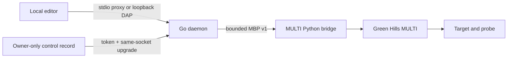

# Security Model

`multi-dap` can halt, resume, inspect, and otherwise control a debug target.
Localhost placement reduces exposure but does not make the adapter harmless.

## Trust boundaries

- DAP, MBP, hint, and control listeners bind only to numeric loopback
  addresses.
- The control token is stored in an owner-only runtime record. Editor
  extensions do not read or log it.
- Config-bound commands compare an opaque digest of normalized validated target
  semantics before authenticating, forwarding DAP, or requesting shutdown. A
  same-ID record for different semantics is not reused, removed, or queried.
- `proxy` authenticates and upgrades the same control socket into DAP; it does
  not trust a separately reported DAP address and redial it.
- Only one active DAP frontend owns the control lease.
- The bridge exposes typed operations and sanitized failures. Raw target output
  must not be propagated into logs or terminal diagnostics by default.

Loopback is a machine boundary, not a user boundary on every operating system.
Run the daemon only on a trusted, single-user development host and keep the
control directory private.

## Sensitive data

Treat the following as secrets or private engineering data:

- target-server and connection arguments;
- control tokens and live runtime records;
- private ELF/source paths and firmware contents;
- target addresses, symbols, raw debugger output, and captures;
- probe, board, device, and license identifiers.

Project-specific TOML files belong outside the repository. `recon/out`, local
config, temporary controls, and hardware scratch data must remain ignored and
must never enter release archives.

## Fail-closed requirements

- Ambiguous core or source identity is an error, never a first-match choice.
- Unsupported DAP fields and actions are rejected before bridge I/O.
- Expired stop-epoch handles never resolve to a new object.
- Timed-out or stale bridge generations are not reused.
- Warm acquisition never falls back to cold acquisition.
- A parent `ensure` passes its expected configuration binding to the child; the
  child compares it before control reservation or MULTI runtime startup.
- The supported editor proxy uses `--config`. The legacy identity-only
  `--probe-id` path is not a configuration-authenticating boundary.
- The process never kills unrelated MULTI, router, or target-server processes
  by name.

Changes that weaken one of these rules require an architecture decision,
targeted negative tests, and a security review.

## Supply chain and CI

- GitHub Actions receive `contents: read` by default, use no persisted checkout
  credential, and are pinned to reviewed action commits.
- Only the release publish job receives `contents: write`. A separate
  no-checkout attestation job receives narrowly scoped OIDC, attestation, and
  artifact-metadata permissions after the read-only candidate job has uploaded
  the already-built release assets.
- Go dependencies are checked through `go.sum` and release builds use
  `-mod=readonly`.
- CI, the tag workflow, and the weekly read-only security workflow run the
  pinned `govulncheck` version against the current Go vulnerability database.
  A successful result is time-bounded and must be repeated for a release.
- CI and the tag workflow run the pinned `actionlint` version in addition to
  the repository's semantic action-reference and trigger policy checks.
- The Windows archive is deterministic, allowlisted, and contains internal
  payload hashes; the release also carries an outer archive checksum.
- The public source and packaged binary are MIT-licensed. Public release still
  requires review of the exact source revision, workflow run, artifact digest,
  and release notes.
- `packaging/release-policy.json` is a positive publication gate: it must name
  the MIT license, explicitly approve public distribution, and bind the exact
  root license digest. Text or name changes require a new reviewed digest;
  phrase removal alone cannot enable publication.
- Release archives carry `THIRD_PARTY_NOTICES.md` and the full Go and go-toml
  license texts required for binary redistribution.
- Ordinary CI validates package construction without uploading the package.
  The public tag workflow uploads candidate artifacts and draft-release assets
  only while the positive distribution policy remains valid.

The package is not code-signed yet. A future Authenticode or Sigstore policy
must bind the exact candidate digest and must not rebuild during approval.

## Vulnerability handling

Follow the private reporting process in the repository-level `SECURITY.md`.
Critical or high-severity issues in authentication, listener binding, target
mutation boundaries, path handling, archive construction, or secret handling
block publication. Lower-severity risk acceptance must name an owner, scope,
compensating control, and review trigger.
